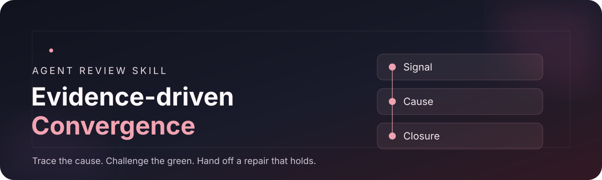

<p align="center">
  
</p>

<p align="center">
  <a href="https://github.com/KK-Skyline/evidence-driven-convergence/actions/workflows/checks.yml"></a>
  <a href="LICENSE"></a>
  
</p>

<p align="center">
  Created by <a href="https://github.com/KK-Skyline">KK-Skyline</a> with OpenAI Codex (AI assistant)
</p>

<p align="center">
  <a href="#what-it-does">What it does</a> ·
  <a href="#get-started">Get started</a> ·
  <a href="#optional-jev-screen">Jev screen</a> ·
  <a href="#evidence-and-limits">Evidence</a> ·
  <a href="#credits">Credits</a> ·
  <a href="#license">License</a>
</p>

> **For the moment between review and repair.** This Agent Skill helps a reviewer check whether a proposed fix addresses the cause, explains why earlier checks missed it, covers affected paths, and has an acceptance test that a superficial patch would fail.

## What it does

| Trace the behavior | Challenge a green result | Hand off a repair |
| :--- | :--- | :--- |
| Follow the real entry point through shared decisions, callers, state, and consumers. | Ask which plausible incorrect implementation could pass the current checks. | Give Coding the code cause, the escape cause, affected paths, repair direction, and falsifiable acceptance criteria. |

The [skill instructions](SKILL.md) fit inside the existing coding and review loop. Reviewers keep the final judgment. The optional Jev screen highlights possible holes in a **written repair plan**; it does not approve code or issue a validation result.

```text
Current goal and contract
         │
         ▼
Code + tests ──► Reviewer traces the affected behavior
                         │
                         ▼
                Causal repair plan
                         │
                  optional Jev advice
                         │
                         ▼
                Coding → re-review
```

## Get started

Clone the repository into your Codex skills directory:

```bash
git clone https://github.com/KK-Skyline/evidence-driven-convergence.git \
  "$HOME/.codex/skills/evidence-driven-convergence"
```

Then ask Codex to use **`$evidence-driven-convergence`** before reviewing a substantial coding change or when preparing a repair handoff. Codex loads [SKILL.md](SKILL.md) and reaches the narrower references only when needed. No external service is needed for the core review workflow.

The optional screener needs only the Python standard library. Run its local tests with:

```bash
python3 -B -m unittest discover -s tests -p 'test_*.py' -v
```

## Optional Jev screen

The screener asks five bounded questions about a proposed plan: cause evidence, escape analysis, affected paths, acceptance, and scope. Prepare a request **offline by default**:

```bash
python3 -B scripts/screen_plan.py assets/example-packet.json \
  --model jev-latest --out /tmp/repair-screen-prepared.json
```

Inspect the generated request before sending any real project material. Live mode requires a separately configured `TYPESAFE_API_KEY` and the explicit `--live` flag. See the [screening guide](references/jev-screening.md) for the packet format, privacy boundary, and failure handling. The included packet is synthetic development data.

## Evidence and limits

- The local adapter has tests for offline behavior, packet integrity, malformed responses, replay binding, and advisory status. The [workflow badge](https://github.com/KK-Skyline/evidence-driven-convergence/actions/workflows/checks.yml) reports that repository test job only.
- Small self-authored exercises showed that requirement-derived behavior checks can expose selected seeded faults and that a causal repair plan can reject a symptom-only fix. They are described, with limitations, in [provenance and evaluation](references/retrospective-and-cases.md).
- **Jev has not been evaluated here on live repair plans.** There is no measured claim that this skill reduces real-world rework, review time, or token cost. The [evaluation protocol](references/screening-evaluation.md) describes how to test those claims without treating an agent's agreement as ground truth.

## Project map

```text
SKILL.md                       Main review workflow
references/repair-plan.md      Causal repair handoff
references/jev-screening.md    Optional Jev branch
references/screening-evaluation.md  Future live evaluation
scripts/screen_plan.py         Offline-first advisory CLI
tests/                         Standard-library adapter tests
```

For questions or improvements, open an [issue](https://github.com/KK-Skyline/evidence-driven-convergence/issues). A useful report includes the contract, an anonymized proposed repair, the result the screen missed or misclassified, and what later review or tests established. Keep private code and credentials out of public issues.

## Credits

**Project direction and maintenance:** [KK-Skyline](https://github.com/KK-Skyline). **Skill writing, implementation, tests, and documentation assistance:** OpenAI Codex (AI assistant), working with KK-Skyline's requirements and review. This credits AI assistance without implying that the assistant has a GitHub contributor account or owns the project's copyright.

## License

Released under the [Apache License 2.0](LICENSE). Commercial use is allowed; redistribution requires the license and applicable attribution notices, including the [NOTICE](NOTICE) file. The license does not require users to report commercial use.

Revisions through [96dc930](https://github.com/KK-Skyline/evidence-driven-convergence/commit/96dc930) were published under the [MIT License](https://github.com/KK-Skyline/evidence-driven-convergence/blob/96dc930/LICENSE); changing the current license does not withdraw that earlier grant.
